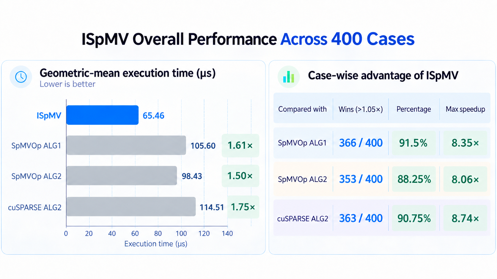

# ISpMV

**Intelligent Sparse Matrix–Vector Multiplication for GPUs.**

ISpMV preprocesses a fixed sparse matrix on the GPU and builds a reusable execution plan for SpMV(α, β):

$$
y \leftarrow \alpha A x + \beta y.
$$

It targets iterative workloads that repeatedly apply the same matrix to changing vectors.



H100 PCIe 80GB · FP64 · 100 matrices × 2 directions × 2 operations. Preprocessing excluded. [Benchmark details](benchmarks/README.md#results).

Distributed as a C/C++ binary SDK; the core implementation source is private.

[Download the SDK](https://github.com/PolyU-IOR/ISpMV/releases/tag/v0.1.0) · [Installation](docs/INSTALL.md) · [API](docs/API.md)

## Quick start

Requires Linux x86-64, a compatible NVIDIA GPU and driver, CUDA 13 development files, cuBLAS 13, CMake ≥ 3.24 and a C++17 compiler.

Download the SDK archive and checksum file from the release, then run:

```sh
export ISPMV_PACKAGE=ISpMV-0.1.0-linux-x86_64-cuda13

sha256sum -c "$ISPMV_PACKAGE.tar.gz.sha256" &&
tar -xzf "$ISPMV_PACKAGE.tar.gz"

export ISPMV_SDK="$PWD/$ISPMV_PACKAGE"
export LD_LIBRARY_PATH="$ISPMV_SDK/lib${LD_LIBRARY_PATH:+:$LD_LIBRARY_PATH}"

cmake -S "$ISPMV_SDK/examples" -B example-build \
  -DCMAKE_PREFIX_PATH="$ISPMV_SDK" -DISPMV_EXAMPLE_DEVICE=ON
cmake --build example-build
./example-build/ispmv_device
```

Expected output: `[7,0]`.

The example uploads CSR, builds a GPU plan and reuses it. See the [installation guide](docs/INSTALL.md) for CUDA paths and GPU coverage.

## Usage

### Link the library

```cmake
find_package(ISpMV 0.1.0 CONFIG REQUIRED COMPONENTS runtime)
target_link_libraries(your_solver PRIVATE ISpMV::runtime)
```

Configure your project with `-DCMAKE_PREFIX_PATH="$ISPMV_SDK"`.

If your application calls CUDA APIs directly:

```cmake
find_package(CUDAToolkit REQUIRED)
target_link_libraries(your_solver PRIVATE CUDA::cudart)
```

### Prepare once, execute repeatedly

Initialize `ispmv::Device` once to identify the current GPU, then reuse it when building plans. The SDK includes compiled support for A100, H100/H200, B200, RTX 4090 and RTX 5090; see [hardware support](docs/HARDWARE.md).

Once the GPU-resident CSR arrays are ready, build a reusable plan and execute it repeatedly with GPU-resident vectors.

```cpp
#include <ispmv/ispmv.hpp>

ispmv::Device device;  // identify the current GPU once
auto A = ispmv::device_csr_view(rows, cols, nnz, d_offsets, d_indices, d_values);
auto config = ispmv::default_config();
config.copy_device_matrix = 1;  // 1: copy GPU arrays (default); 0: use them directly
config.deterministic = 1;       // 1: deterministic (default); 0: allow nondeterministic reductions
ispmv::Plan plan(device, A, config);  // preprocess once on GPU

for (int k = 0; k < iterations; ++k) {
    // Update x_device on the same stream.
    plan.spmv(x_device, y_device, stream);  // y = A x
}
```

With `copy_device_matrix = 0`, keep the CSR arrays unchanged and allocated until the plan is released. Determinism applies to a fixed plan and GPU with identical inputs.

For general SpMV:

```cpp
plan.spmv(alpha, x_device, beta, y_device, stream);
```

Initialize `y_device` when β is nonzero. Synchronize before reading results on the CPU or releasing the plan and buffers.

For A and Aᵀ, prepare two independent plans using the same device handle. See the [API](docs/API.md) for ownership and streams, and [file input](docs/INSTALL.md#file-input) for matrix formats.

## Benchmarks

**Configuration:** H100 PCIe 80GB · FP64 · CUDA 13.4.2 · cuSPARSE 12.8.6.72.

**Datasets:** Mittelmann: 49 matrices; MIPLIB: 18 matrices with nnz > 10M; SuiteSparse: 33 matrices with nnz > 10M. Both A and Aᵀ are tested with (α, β) = (1, 0) and (1.25, −0.375), totaling 200 directions and 400 cases. [Matrix list](benchmarks/matrices.csv).

**Numerical accuracy:** All cases where ISpMV exceeds the numerical criterion also occur for the other three methods; cuSPARSE ALG2 has one additional case. [Numerical criteria and accuracy results](docs/API.md#numerical-checks).

Preprocessing time in **ms per direction** (geometric mean):

| Mittelmann | MIPLIB (nnz > 10M) | SuiteSparse (nnz > 10M) |
|---:|---:|---:|
| 37.23 | 73.96 | 109.68 |

Measured from device CSR ready, excluding upload and one-time device initialization.

[Benchmark details and data](benchmarks/README.md)

## Documentation

[Installation](docs/INSTALL.md) · [API](docs/API.md) · [Hardware](docs/HARDWARE.md) · [Benchmarks](benchmarks/README.md) · [Validation](docs/VALIDATION.md) · [Limits](docs/LIMITATIONS.md)

## License

Public interfaces, examples, benchmarks and documentation use the [MIT license](LICENSE). The compiled core uses the [ISpMV Binary License](LICENSE-BINARY.txt). See [third-party notices](licenses).
